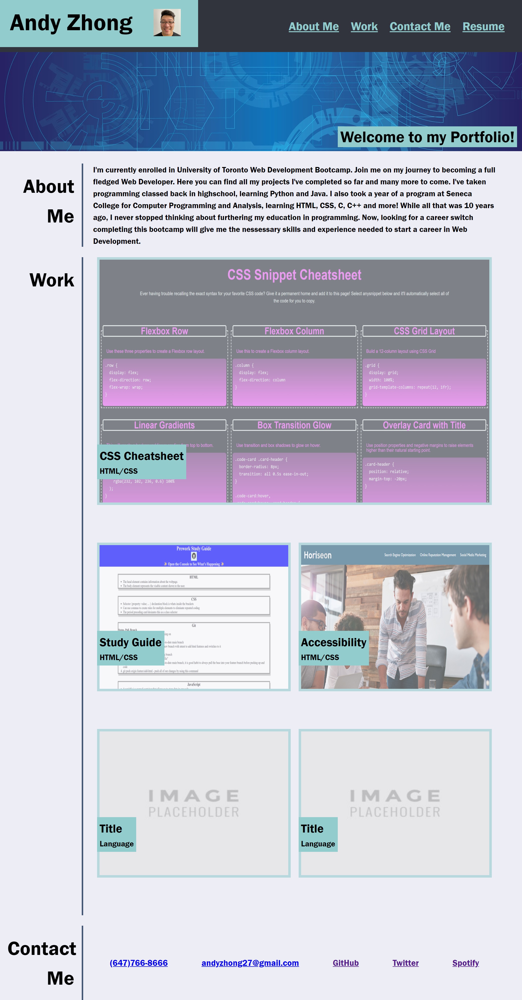
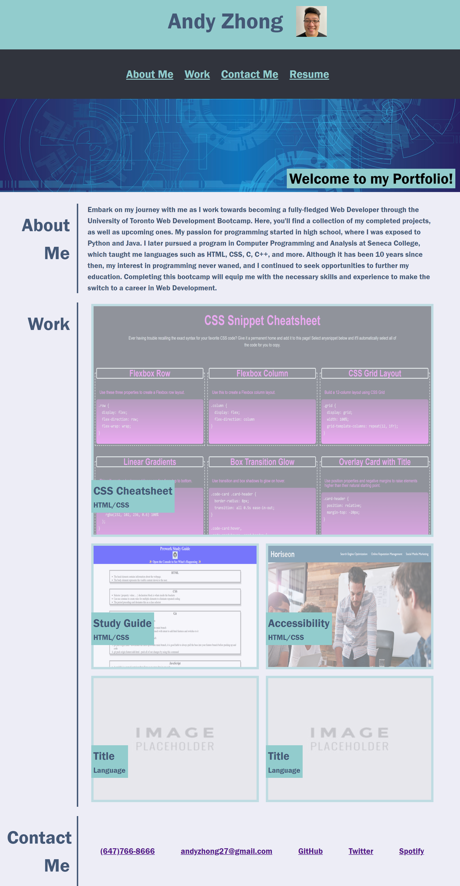
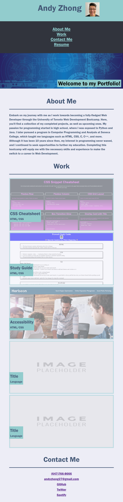

# Andy-Zhong-Portfolio

## Description

This project is my portfolio using the skilled learned so far.  
Using HTML and CSS to recreate a webpage based off of a gif.
This webpage gives a home to all my completed projects and projects to come.  
Working on this project, I gained a better understanding of how to use Flexbox, CSS selectors, relative positioning and how to structure my HTML code so that I could have the nessary containers needed for my CSS selectors.

## Usage

Using media queries, I made the webpage adaptable to different viewports.

Desktop viewport

Tablet viewport

Mobile viewport

Webpage Link
https://timebytes.github.io/Andy-Zhong-Portfolio/

## Credit

Hero background image from pixabay.com
https://pixabay.com/photos/water-sea-caribbean-background-1330252/

## License

MIT License
